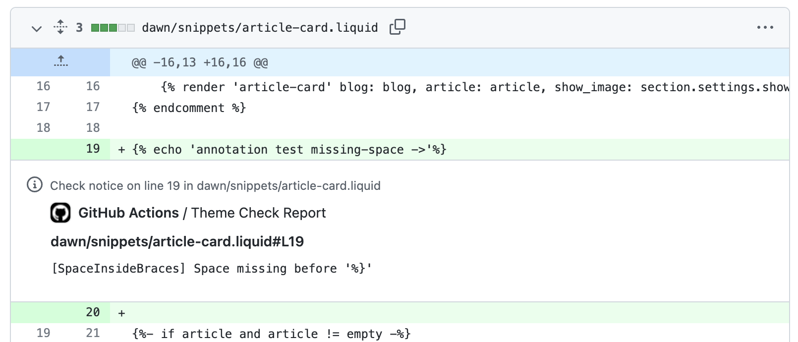

# shopify/theme-check-action

[About this repo](#about-this-repo) | [Usage](#usage) | [Configuration](#configuration)

## About this repo

[`shopify theme check`](https://shopify.dev/docs/themes/tools/theme-check) on Shopify Theme Pull Requests using GitHub Actions.



## Usage

Add `shopify/theme-check-action@v2` to the workflow of your Shopify theme.

```yml
# .github/workflows/theme-check.yml
name: Theme Check
on: [push]
jobs:
  theme-check:
    name: Theme Check
    runs-on: ubuntu-latest
    steps:
      - uses: actions/checkout@v4
      - name: Theme Check
        uses: shopify/theme-check-action@v2
        with:
          theme_root: '.' # optional, could be './dist'
          token: ${{ github.token }}
          base: main
```

## Configuration

> **Note:**
>
> For Theme Check Ruby support (`v1.X.X`), refer to the [`v1` documentation](https://github.com/Shopify/theme-check-action/tree/v1).

`shopify/theme-check-action@v2` accepts the following arguments:

- `theme_root` - (optional, default: `'.'`) Path from repo root to the root of the theme (e.g. `'./dist'`).
- `flags` - (optional) theme-check command line flags. (e.g. `'--fail-level suggestion'`)
- `version` - (optional, default: latest) specific [Shopify CLI](https://shopify.dev/docs/storefronts/themes/tools/cli) `@shopify/theme` (`v3.50`+) to use.
- `token` - (optional) result of `${{ github.token }}` to enable GitHub check annotations.
- `base` - (optional) When `token` is set, only the files that contain a diff with this ref (branch, tag or commit) will have GitHub check annotations.
